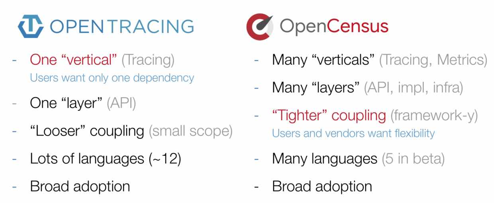
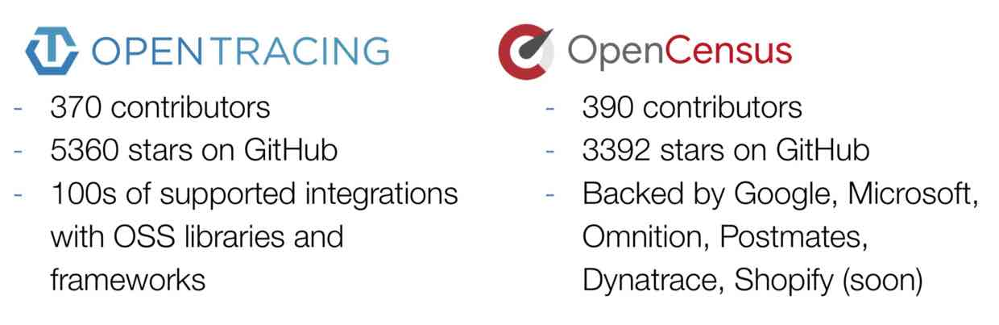
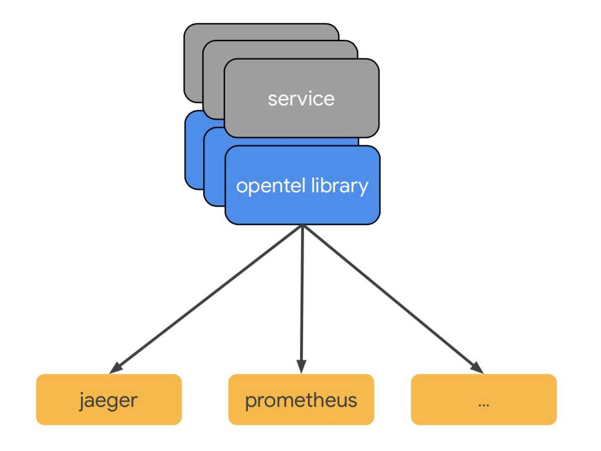
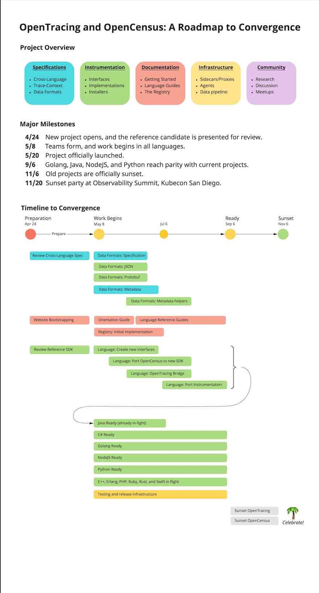

> 大家应该都听说过APM(Application Performance Monitoring)，也应该听说过Distributed Tracing(分布式跟踪)，其中后者是前者的子集。分布式跟踪该名词是随着微服务的流行而兴起的，主要是为了解决微服务架构中请求链路过长导致的定位和监控难问题。
目前该领域有名的产品有：Jaeger、Pinpoint、Zipkin等等，可以说是竞争异常激烈，但是由此带来一个问题：每一家都有自己的一套数据采集标准和SDK，虽然几乎都是基于谷歌Dapper协议，但是彼此的实现是大相径庭的。
为了解决这个问题，国外的大神们在之前创建了OpenTracing和OpenCensus，我们先来分别看看这两个产品。 

# OpenTracing
OpenTracing制定了一套平台无关、厂商无关的协议标准，使得开发人员能够方便的添加或更换底层APM的实现。

在2016年11月的时候发生了一件里程碑事件，CNCF.io接受OpenTracing，同时这也是CNCF的第三个项目，前两个都已经鼎鼎大名了：Kubernetes，和Prometheus，由此可见开源世界对APM的重视，对统一标准的重视和渴望。 

遵循OpenTracing协议的产品有Jaeger、Zipkin等等。

# OpenCensus
中国有句老话，既生瑜何生亮，OpenTracing本身出现的更早且更流行，为什么要有OpenCensus这个项目？

>这里先补充一下背景知识，前面提到了分布式追踪，其实在APM领域，还有一个极其重要的监控子类：Metrics指标监控，例如cpu、内存、硬盘、网络等机器指标，grpc的请求延迟、错误率等网络协议指标，用户数、访问数、订单数等业务指标，都可以涵盖在内。

首先，该项目有个非常牛逼的亲爹：Google，要知道就连分布式跟踪的基础论文就是谷歌提出的，可以说谷歌就是亲爹无疑了。

其次，OpenCensus的最初目标并不是抢OpenTracing的饭碗，而是为了把Go语言的Metrics采集、链路跟踪与Go语言自带的profile工具打通，统一用户的使用方式。随着项目的进展，野心也膨胀了，这个时候开始幻想为什么不把其它各种语言的相关采集都统一呢？然后项目组发现了OpenTracing，突然发现，我K，作为谷歌，我们都没玩标准，你们竟然敢玩标准敢想着统一全世界？(此处乃作者的疯人疯语) 于是乎，OpenCensus的场景进一步扩大了，不仅做了Metrics基础指标监控，还做了OpenTracing的老本行：分布式跟踪。

有个谷歌做亲爹已经够牛了，那再加入一个微软做干爹呢？是不是要起飞了？所以，对于OpenCensus的发展而言，微软的直接加入可以说是打破了之前的竞争平衡，间接导致了后面OpenTelemetry项目的诞生。

# Tow Rounds PK
先来看一张Round 1的PK图：

可以看到，OpenTracing和OpenCensus从功能和特性上来看，各有优缺点。OpenTracing支持的语言更多、相对对其他系统的耦合性要更低；OpenCensus支持Metrics、分布式跟踪,同时从API层一直到基础设施层都进行了支持。

难分胜负？再来对比下社区活跃，我去，好像还是半斤八两，你有更广的使用群众基础，我有谷歌和微软就足矣。

所以，从上面可以看出，两个产品真的是各红遍半边天，但是作为开源项目，这种竞争未免太消耗资源了，对用户也十分不友好，咋么办？

# OpenTelemetry
正所谓是：天下合久必分、分久必合，在此之时，必有枭雄出现：OpenTelemetry横空出世。

两个产品合并，首先要考虑的是什么？有过经验的同学都知道：如何让两边的用户能够继续使用。因此新项目首要核心目标就是兼容OpenTracing和OpenCensus。

OpenTelemetry的核心工作目前主要集中在3个部分：

1. 规范的制定和协议的统一，规范包含数据传输、API的规范，协议的统一包含：HTTP W3C的标准支持及GRPC等框架的协议标准
2. 多语言SDK的实现和集成，用户可以使用SDK进行代码自动注入和手动埋点，同时对其他三方库（Log4j、LogBack等）进行集成支持；
3. 数据收集系统的实现，当前是基于OpenCensus Service的收集系统，包括Agent和Collector。

由此可见，OpenTelemetry的自身定位很明确：数据采集和标准规范的统一，对于数据如何去使用、存储、展示、告警，官方是不涉及的，我们目前推荐使用Prometheus + Grafana做Metrics存储、展示，使用Jaeger做分布式跟踪的存储和展示。

>首先，再补充一下背景知识，之前提到了APM的两种监控子类：分布式跟踪和Metrics，其实还有第三种，就是Logging日志，目前常见的日志收集平台有EFK、Fluentd.

上图中可以看到，缺失了Logging，主要有以下原因：
1. 优先级是在上面提到的三个核心工作上，Logging目前优先级相对较低(P2)
2. Logging一般是通过三方平台完成收集，目前如何与分布式跟踪、Metrics的数据进行整合，官方还没有给出设计方案

### 大一统
有了以上的背景知识，我们就可以顶一下OpenTelemetry的终极目标了：实现Metrics、Tracing、Logging的融合及大一统，作为APM的数据采集终极解决方案。
- Tracing：提供了一个请求从接收到处理完成整个生命周期的跟踪路径，一次请求通常过经过N个系统，因此也被称为分布式链路追踪
- Metrics：例如cpu、请求延迟、用户访问数等Counter、Gauge、Histogram指标
- Logging：传统的日志，提供精确的系统记录

这三者的组合可以形成大一统的APM解决方案：
1. 基于Metrics告警发现异常
2. 通过Tracing定位到具体的系统和方法
3. 根据模块的日志最终定位到错误详情和根源
4. 调整Metrics等设置，更精确的告警/发现问题

##### 该如何融合？
在以往对APM的理解中，这三者都是完全独立的，但是随着时间的推移，人们逐步发现了三者之间的关联，例如我们可以把Tracing的TraceID打到Logging的日志中，这样可以把分布式链路跟踪和日志关联到一起，彼此数据互通，但是还存在以下问题：
1. 如何把Metrics和其他两者关联起来
2. 如何提供更多维度的关联，例如请求的方法名、URL、用户类型、设备类型、地理位置等
3. 关联关系如何一致，且能够在分布式系统下传播

在OpenTelemetry中试图使用Context为Metrics、Logging、Tracing提供统一的上下文，三者均可以访问到这些信息，同时Context可以随着请求链路的深入，不断往下传播
- Context数据在Task/Request的执行周期中都可以被访问到
- 提供统一的存储层，用于保存Context信息，并保证在各种语言和处理模型下都可以工作（例如单线程模型、线程池模型、CallBack模型、Go Routine模型等）
- 多种维度的关联基于元信息(标签)实现，元信息由业务确定，例如：通过Env来区别是测试还是生产环境等
- 提供分布式的Context传播方式，例如通过W3C的traceparent/tracestate头、GRPC协议等

### Roadmap

几个预估的主要时间点
- 2019年9月，发布主要语言版本的SDK，生产可用
- 2019年11月，OpenTracing和OpenCensus正式不再维护(ReadOnly)
- 在两年时间内提供对OpenTracing和OpenCensus的协议兼容

# 总结
从谷歌Dapper协议提出到现在已经很多年了，江湖也已经乱战了很多年，这次谷歌和微软下定决心结束江湖之乱，对于未来分布式系统的监控真的是非常巨大的利好消息，我们也有理由相信在这两家巨头的主导，该项目会越发展越好，未来会有越来越多的开源项目、框架、平台，原生的使用OpenTelemetry，最终实现监控数据标准的大一统